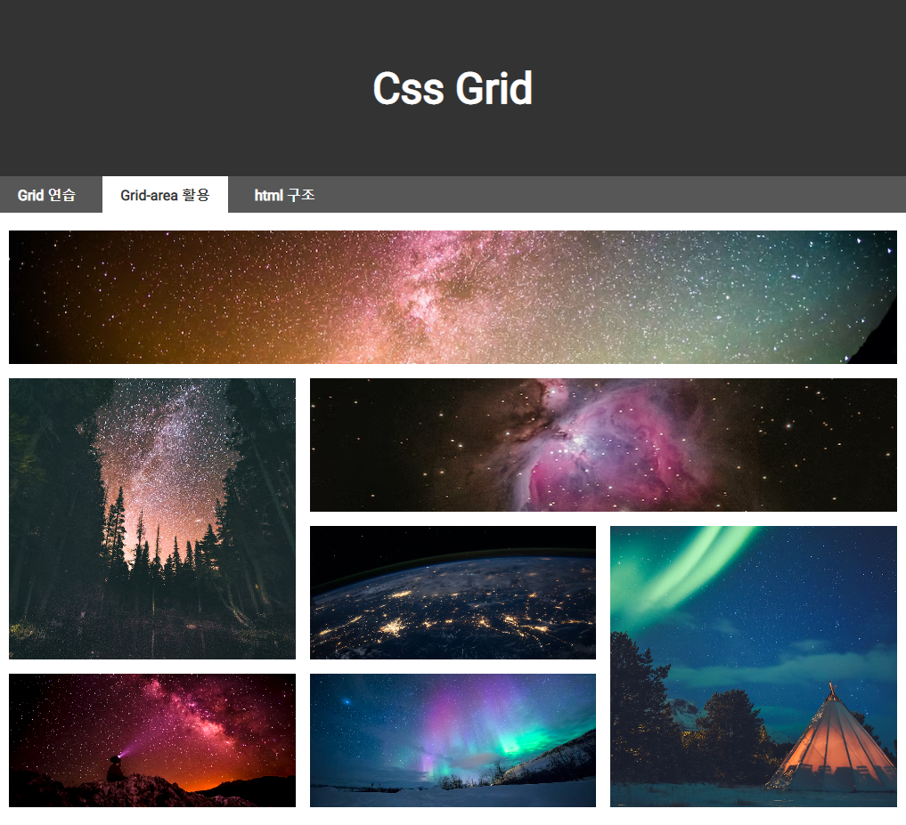

<a href="https://hyemin12.github.io/css-grid/" target="_blank"></a>

이미지를 클릭해서 사이트로 이동하세요.

<br>
<hr>
<br>

# Css grid

부모 요소에 <code>display:grid</code> 적용시 자식 요소들은 grid cell로 변함

## Grid (부모요소 / container)

|       구분       |        명령어         |
| :--------------: | :-------------------: |
| 가로 사이즈 설정 | grid-template-columns |
| 세로 사이즈 설정 |  grid-template-rows   |
|  레이아웃 설정   |  grid-template-areas  |
| 그리드 간격 설정 |       grid-gap        |

<br>
<br>

### grid-template-columns

-가로 열 설정  
-px, %, fr 단위로 사용 가능  
-반복 시 repeat() 사용하여 코드 간단하게 작성 가능

```css
.container {
  grid-template-columns: 100px 100px;
  grid-template-columns: 50% 50%;
  grid-template-columns: 50% 50%;

  /* 반복 */
  grid-template-columns: repeat(5, 100px);
}
```

<br>
<br>

### grid-template-columns

-세로 행 설정  
-px, %, fr 단위로 사용 가능  
-반복 시 repeat() 사용하여 코드 간단하게 작성 가능  
-grid-auto-rows를 사용하여 자동 조절할 수 있음  
-minmax()를 사용하여 최소값, 최대값 설정 가능

```css
.container {
  grid-template-rows: 100px 100px;
  grid-template-rows: 50% 50%;
  grid-template-rows: 50% 50%;

  /* 반복 */
  grid-template-rows: repeat(5, 100px);

  /* 높이 자동 조절 */
  grid-auto-rows: auto;

  /* 최소값, 최대값 설정 */
  /** ~150px: 고정
      150px~: 자동조절 */
  grid-auto-rows: minmax(150px, auto);
}
```

<br>
<br>

### grid-template-areas

-자식 요소의 grid-area 속성으로 그리드 영역의 이름을 참조하여, 그리드 템플릿 영역을 설정

-부모 요소: grid-template-areas를 이용하여 그리드 템플릿 영역 설정  
-자식 요소: grid-area를 이용하여 그리드 영역 이름 설정

```css
/* 부모요소 */
.container {
  grid-template-areas: "a b";
}

/* 자식요소 */
.item1 {
  grid-area: a;
}
.item1 {
  grid-area: b;
}
```

<br>
<br>

## Grid cell (자식요소 / item)

|                      구분                      |      명령어       |
| :--------------------------------------------: | :---------------: |
|      특정 item을 표시하기 시작할 열 지정       | grid-column-start |
|      특정 item을 표시하기 끝마칠 열 지정       |  grid-column-end  |
|      특정 item을 표시하기 시작할 행 지정       |  grid-row-start   |
|      특정 item을 표시하기 끝마칠 행 지정       |   grid-row-end    |
| grid-column/grid-row로 단축해서 사용할 수 있음 |

```css
.grid__cell {
  grid-column-start: 2;
  grid-column-end: 4;

  grid-row-start: 1;
  grid-row-end: 3;
}

/* 코드 단순하게 */
/* grid-column/row: 시작할 열/행, 끝날 열/행  */
.grid__cell {
  grid-column: 2 / 4;

  grid-row: 1 / 3;
}
```
